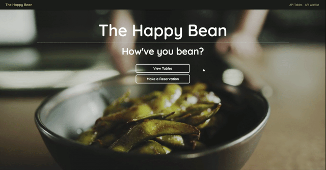
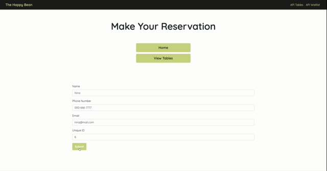

# The Happy Bean
A basic app demonstrating Node and Express with jQuery. The overall purpose is to help schedule reservation requests for a fictional restaurant that has just 5 tables available. The first five requests get a reservation, all others are sent to the waiting list.

See a live demo [here](https://thehappybean.herokuapp.com/).

## Contributors
[Nivedita Amanjee](https://github.com/niviamanjee)
[Nadine Juraschek](https://github.com/nadinejuraschek)

## Technologies
* Node.js
    * Express
    * Body Parser
* jQuery
* JavaScript
* Bootstrap

## Preview
#### Home

#### Make Reservation

#### Waiting List
